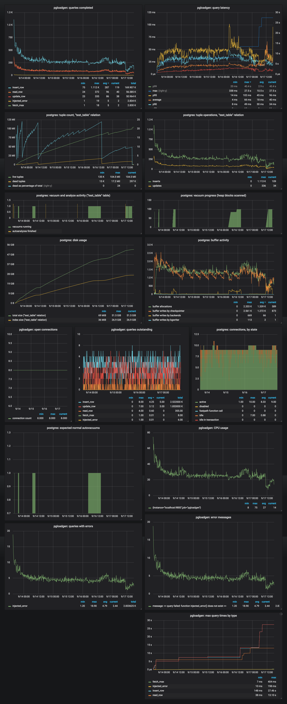
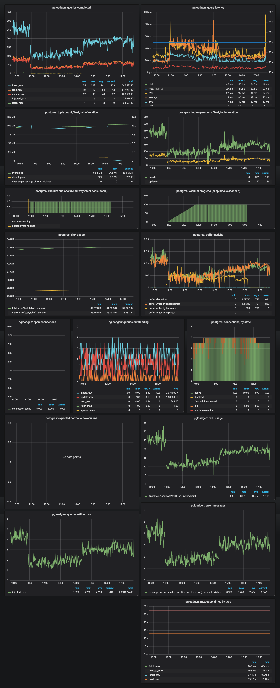

# postgres-loadgen

This repository contains tools, notes, and data related to a PostgreSQL
performance experiment intended to replicate behavior observed with PostgreSQL
in Manta.  The main goal of the test was to see what would happen to performance
of this particular workload (described below) over an extended period.

Essentially, the experiment involved:

- setting up a new PostgreSQL instance
- creating a schema having 5 text columns, 3 of them indexed
- running a load generator that's mostly-insert of random data, with additional
  components of random read and random update
- monitor the latency and throughput through several rounds of vacuum, including
  anti-wraparound vacuum

## Hardware and software configuration

The experiment was run on a Macbook Pro (4-core i7, 16 GiB DRAM, 500 GiB SSD)
under VMware Fusion 8.1.1.  The virtualized environment included:

- 4 cores
- 8 GiB memory: 8 GiB
- 75 GiB disk file (preallocated by VMware)
- SmartOS release 20180830
- ZFS.  The PostgreSQL dataset used an 8K recordsize.

The software setup used PostgreSQL 9.6.3 (to match existing deployments where we
see this behavior).  The configuration is described under
[notes/postgres.conf](notes/postgres.conf) in this repository.  The default
PostgreSQL configuration for 9.6.3 is in the same directory for comparison.
Key differences:

- `shared_buffers = 1024 MB` (25% of memory available to the VM)
- `dynamic_shared_memory_type = sysv`
- `wal_level = hot_standby`
- `checkpoint_timeout = 30s`

Monitoring software ran from OS X, using:

- [pgstatsmon](https://github.com/joyent/pgstatsmon)@c3c085eeac127b37674809d0d41bd5fc368e744e
- [prometheus](https://prometheus.io) 2.3.2 (later 2.4.0)
- [grafana](https://grafana.com/) 5.2.4

## Workload

Initially, a [schema](notes/schema.sql) is created with a unique integer id,
five string columns, and three indexes (each on one of the text columns):

    CREATE SEQUENCE test_table_id;
    
    CREATE TABLE test_table (
        id bigint NOT NULL DEFAULT nextval('test_table_id'),
        c1 text,
        c2 text,
        c3 text,
        c4 text,
        c5 text
    );
    
    CREATE UNIQUE INDEX by_id ON test_table (id);
    CREATE INDEX by_c1 ON test_table (c1);
    CREATE INDEX by_c2 ON test_table (c2);
    CREATE INDEX by_c3 ON test_table (c3);

The [load generator](loadgen) is contained in this repository.  The load
generator has a fixed concurrency and makes the following requests:

- 60% of requests: insert one row containing v4 uuids (random strings)
- 20% of requests: read one random row from the table (by selecting a random
  integer from 1 to the highest id known to exist in the table)
- 18% of requests: update one random row from the table (selecting the row
  first, using the same approach that the "read" request does)
- 1% of requests: execute an invalid SQL string (used to verify error reporting)
- 1% of requests: fetch the maximum id in the table (used for the "read" and
  "update" requests)

The load generator was configured with a concurrency of 8.  This was chosen
to maximize load while keeping CPU usage comfortably under 1 core so that the
load generator would not be a bottleneck for latency.  (It was quickly found
that while initial CPU usage was about 75%, average latency quickly increased,
causing CPU usage to fall to only about 30% for most of the run.  We may have
been able to use more concurrency to test at a higher load; however, we were
mostly interested in the degradation, not the peak performance.)

## Measuring performance

The key metrics for this experiment are:

- query latency, measured by the load generator
- query throughput, measured by the load generator

To validate the experiment, we also monitored:

- errors, measured by the load generator (since unexpected errors would indicate
  that the system wasn't doing what we expected)
- CPU usage of the load generator (to ensure that the load generator itself is
  not a bottleneck)
- open connections, measured by the load generator (to ensure that we had the
  concurrency we expected)
- open connections, measured at PostgreSQL, with a field for the PostgreSQL
  connection state (for the same reason, and to verify that the connections were
  being used as expected)

Finally, to help understand the behavior, we also monitored:

- live tuples, dead tuples, and total tuple count in our test table
- the fraction of dead tuples in our test table (in order to estimate when
  normal autovacuum would kick off)
- the presence and progress of vacuum operations on our test table
- disk usage
- PostgreSQL buffer activity

To accomplish this, the load generator reports metrics via a Prometheus endpoint:

- `pgloadgen_nconns`: a gauge of open connections
- `pgloadgen_query_latency_max_us`: a gauge of the maximum latency observed,
  with a field for the request type
- `pgloadgen_nqueries_started`: a counter of requests started, with a field for
  the request type
- `pgloadgen_nqueries_done`: a counter of requests completed, with a field for
  the request type
- `pgloadgen_nqueries_failed`: a counter of requests failed, with a field for
  the request type
- `pgloadgen_error_messages`: a counter of requests failed, with a field for the
  error message
- `pgloadgen_query_latency_us`: a histogram of query latency, with a field for
  the request type
- `pgloadgen_cpu_user_us`: a counter of user CPU time for the load generator
- `pgloadgen_cpu_system_us`: a counter of user CPU time for the load generator

Since the load generator is a single Node.js process, we'd expect it to be a
bottleneck if CPU usage approaches 100% of one CPU (1,000,000 microseconds per
second of user + system time).

The PostgreSQL metrics were provided by pgstatsmon, which periodically fetches
various metrics from PostgreSQL directly.

## Approach

The basic approach was to set up all the components (PostgreSQL, the load
generator, and the monitoring components), take a ZFS snapshot, start the
workload, and observe the behavior for an extended period.

The first run was used to make sure the appropriate configuration and metrics
were in place.  Several changes were made during this run, resulting in the
configuration described above.  Then PostgreSQL was stopped.  The filesystem was
rolled back to the initial snapshot, and a second, clean run was started.
Results are available from the first run, but they're not useful, since the
configuration was inappropriate and changing.

The second run produced the results described below.

## Observations

Here's a timeline of the second run:

    2018-09-13T22:08   Z   Load generator started
    2018-09-17T17:53:59Z   Manual "VACUUM FREEZE" began (see below)
    2018-09-17T21:24:54Z   Workaround for OS-7151 applied (see below)
    2018-09-17T23:12:07Z   Manual "VACUUM FREEZE" finished (5h 18m)
    2018-09-18T00:50   Z   Load generator stopped; experiment finished (just over 4 days)

The notes below summarize [the metrics for the full
run](./runs/run2-2018-09-13-02/run2-overall.png).  (Regrettably, confusingly,
the dashboard is shown in Pacific time, UTC-7.)

First, a few notes to validate the result:

- CPU usage of the load generator was consistently under 100% of one core, so it
  should not have been a bottleneck for query latency.  (It's still possible --
  and quite likely -- that the database was capable of higher throughput with
  additional load.)
- The only query errors observed during the entire experiment were the expected
  ones (i.e., those injected by the load generator to validate the error
  metrics).
- On average, 8.3 out of 9 PostgreSQL connections were in state "active", with
  0.88 "idle".  (Recall that the load generator uses 8 connections.  pgstatsmon
  uses 1, but it's idle most of the time.)  This reinforces that the load
  generator was not a bottleneck on query latency.

General observations about the system's behavior:

- **Disk usage and autovacuum:** Most of the time, disk usage increases
  proportionally to the number of tuples in the table.  This makes sense.  For
  some period after autovacuum completes, disk usage does not increase even
  though the table size is increasing.  This also makes sense: autovacuum has
  cleaned up space associated with tuples that were invalidated by "UPDATE"
  operations, and those are available for new INSERTs.  After a short time, this
  space is used up, and disk space increases at the same rate as before.
- **Autovacuum progress:** the scan progress reported by
  [pg_stat_progress_vacuum](https://www.postgresql.org/docs/10/static/progress-reporting.html)
  is useful, but the long period where vacuum runs after the main scan is
  complete makes it hard to use this to estimate overall progress.

Most importantly, here's what happened to performance for most of the run:

- The **database disk size** reached the size of `shared_buffers` (1 GiB) within
  a few minutes, and reached the size of the VM's memory (8 GiB) within a little
  over an hour.
- **Throughput** started very high, but quickly plummeted over the first two hours.
- Correspondingly, **load generator CPU usage** started high, but fell during
  that same time.  This makes sense, since as average latency increases, the
  load generator spends more time blocked.
- There was no noticeable impact on query latency or throughput during the first
  three autovacuum operations.  However, there was a notable **elevation in
  query latency (and reduction in throughput) during the fourth autovacuum**.

Around 2018-09-17T17:00Z, available disk space was filling up.  (Note that a
quota was placed on the database at 60 GiB of the 70 GiB disk file, so filling
up 60 GiB means the filesystem is only 80% full.)  We wanted to observe the
impact of an anti-wraparound vacuum, though we had not completed nearly enough
transactions for PostgreSQL to kick one off.  We manually ran `VACUUM FREEZE`.
At that point:

- Query latency shot up: average latency rose from about 23ms to upwards of
  50ms.  While only 20-30ms more, it's a factor of 2-2.5x, so with a fixed
  concurrency, this results in throughput degradation well over 50%.
- During this time, CPU usage of the load generator went down, reflecting higher
  query latency on the PostgreSQL side.

Around 2018-0917T21:00Z, we observed that the autovacuum process was spending
80% of its wall clock time blocked on `write()`.  Neither the zone throttle nor
the ZFS write throttle was engaged, but writes appeared to be blocking because
the disk was saturated.  We did find signs of
[OS-7151](https://smartos.org/bugview/OS-7151), applied a workaround, and saw a
considerable improvement in performance.  Both the degradation in throughput due
to vacuum and the improvement after applying the OS-7151 workaround are best
shown in the [more detailed dashboard for the final
hours](./runs/run2-2018-09-13-02/run2-degradation.png):

As described above, the `VACUUM FREEZE`
began at 10:53 local time, exactly when throughput dropped (_for all
operations_) by well over 50%.  The workaround was applied around 14:20 local
time, when throughput improved considerably, but not nearly to normal levels.
The vacuum finished around 16:12, and throughput appears to improve again, but
does not recover to normal levels before the experiment was over.

## Conclusions and further experiments

The experiment strongly suggests that for the given workload and system
configuration, autovacuum can result in a significant increase in latency.
Freeze vacuums particularly can result in over 2x increase in average latency
and a commensurate decrease in throughput.  This is the same behavior that we've
seen in very large scale Manta deployments.  It must be noted that this
experiment has reproduced the symptoms we've seen elsewhere, but we don't know
for sure that it's the same underlying behavior.

If the experiment were repeated, there are a number of variations that might be
informative.  In all cases, we should create a ZFS snapshot immediately before
starting the `VACUUM FREEZE`.  This would allow us to stop PostgreSQL and the
load generator, rollback to the snapshot, and run a slightly different
experiment.  This would allow us to try several different variations, having
kept all variables the same up to the point of the `VACUUM FREEZE`.  We might
consider these variations:

- Repeat the experiment from the snapshot point to verify the behavior.  (We'd
  expect to see the same result, since the only difference from this experiment
  would be that PostgreSQL and the load generator had stopped and started
  again.)
- Repeat, but instead of the `VACUUM FREEZE`, run another normal `VACUUM`.  This
  would tell us whether any vacuum would be so expensive at that stage in the
  experiment or if `VACUUM FREEZE` really was worse.  (It seems likely based on
  earlier vacuums that the freeze vacuum really is worse.)
- Repeat, but change the concurrency level of the load generator to one that
  results in a throughput level matching the degraded throughput found above.
  Observe whether there's still a degradation when the "VACUUM FREEZE" begins.
  (In other words, does the degradation during the "VACUUM FREEZE" represent a
  _cap_ on throughput during that period or merely an increase in latency?  Our
  expectation is that it's a latency increase, not a cap.)
- For the same reason: repeat, but when the "VACUUM FREEZE" degradation begins,
  double the concurrency of the load generator to see if the original level of
  throughput can be attained (and at what average latency).

It would also be useful to:

- Repeat the experiment in a non-virtualized environment with more disks.
- Measure ZFS fragmentation and metaslab activity for the duration of the
  experiment to see how it grows.
- Run the experiment for much longer (e.g., several weeks), going through
  several natural anti-wraparound vacuum cycles.
